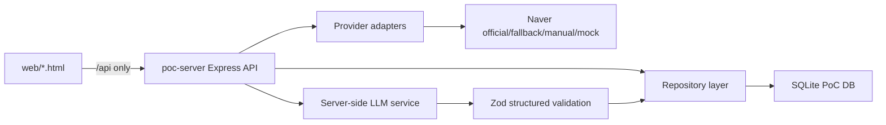

# Runtime Model v0

## Scope

This runtime model is for the Store Learning & Blog Content Automation PoC.

The browser remains a static prototype surface until a future implementation task wires behavior. This docs-only PR does not redesign or change existing HTML pages.

## Runtime Components

| Component | Responsibility |
| --- | --- |
| Static browser pages in `web/` | Render the current prototype screens and call `poc-server` APIs only. |
| `poc-server` Express API | Own product state, validation, mock mode, provider orchestration, LLM orchestration, and static asset serving. |
| Repository layer | Hide SQLite persistence details from routes and workflows. |
| SQLite database | Local PoC persistence for stores, sources, runs, selected content, rulesets, blog posts, generated assets, provider runs, and validated LLM outputs. |
| Provider adapters | Encapsulate Naver Blog, Naver Place, approved fallback providers, manual import, and mock fixture collection. |
| LLM service layer | Build prompts, call OpenAI only from the server, validate structured outputs with Zod, and persist only validated results. |

## Browser Boundary

Browser pages must call `poc-server` APIs only. The browser must not call:

- Naver APIs.
- OpenAI APIs.
- Scraping providers.
- Proxy URLs containing credentials.
- Any external provider endpoint directly.

The browser may poll server endpoints for progress. Server responses must be safe to expose in browser devtools.

## Credential Boundary

Naver/OpenAI credentials must stay server-side. They should be loaded from environment variables by `poc-server` and never written to:

- Static HTML or browser JavaScript.
- Local storage/session storage.
- API responses.
- SQLite rows that are exposed to the browser.
- Screenshots, fixtures, docs examples, or test snapshots.

## Mock Mode

Mock mode is required and must work without external keys.

Suggested environment shape:

| Variable | Meaning |
| --- | --- |
| `POC_MODE=mock` | Use mock provider adapters and deterministic fixture-backed LLM outputs where practical. |
| `POC_MODE=real` | Enable configured provider adapters and OpenAI calls. |
| `OPENAI_API_KEY` | Server-only key used only in real AI calls. |
| `NAVER_CLIENT_ID` / `NAVER_CLIENT_SECRET` | Server-only Naver credentials when official APIs are used. |
| `NAVER_PROVIDER_MODE` | Adapter selector, for example `official`, `fallback`, `manual`, or `mock`. |

In mock mode, all eight product-flow steps must be runnable locally without any external credentials.

## Provider Adapter Model

Real Naver collection must be behind provider adapters.

Provider adapters should expose stable contracts such as:

- `resolvePlaceUrl(url)` returns normalized store identity and official/fallback metadata.
- `collectBlogPosts(settings)` returns metadata and body availability status.
- `collectPlaceProfile(placeId)` returns store profile fields.
- `collectPlaceReviews(placeId)` returns review summaries or a capability error.

Official Naver APIs are limited. The architecture must not assume official APIs provide full blog body text or Place reviews. Full blog body and Place reviews require a separate provider/fallback design, such as approved scraping providers, customer-provided exports, manual import, or mock data.

## LLM Output Model

All LLM outputs must use Zod schemas and structured validation before being saved.

The flow should be:

1. Build prompt inputs from validated repository data.
2. Request structured output from the LLM service.
3. Parse and validate the output with the matching Zod schema.
4. Reject or repair invalid output before persistence.
5. Save only validated structured output plus non-secret run metadata.

## Request Flow

## Initial Runtime States

| State | Meaning |
| --- | --- |
| `not_registered` | Store has not been registered from a Naver Place URL or manual fallback. |
| `registered` | Store profile exists and can configure learning. |
| `settings_ready` | Learning settings are saved. |
| `collecting` | Collection run is active. |
| `collection_failed` | One or more providers failed. |
| `selection_ready` | Collected content is ready for user selection. |
| `analyzing` | Selected content is being analyzed. |
| `analysis_failed` | Ruleset/learning generation failed. |
| `learned` | Strategy ruleset and learning status are available. |
| `content_pending_approval` | Generated blog content is waiting for review. |
| `publish_requested` | Approved content is waiting for agency/publisher action. |
| `published` | Blog content has final published details. |

