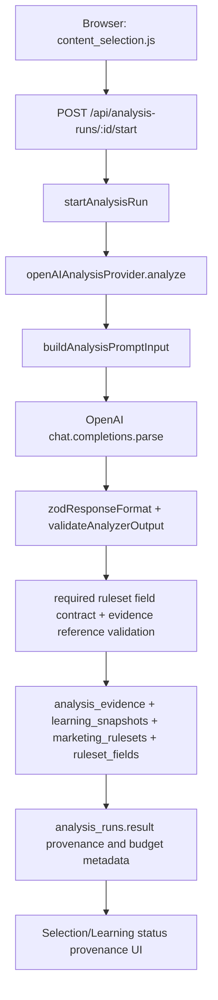
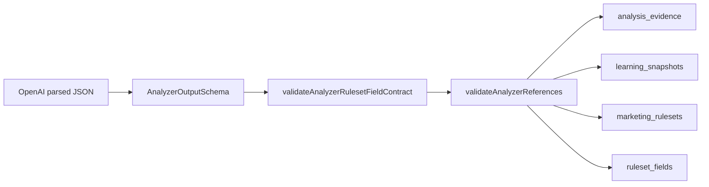
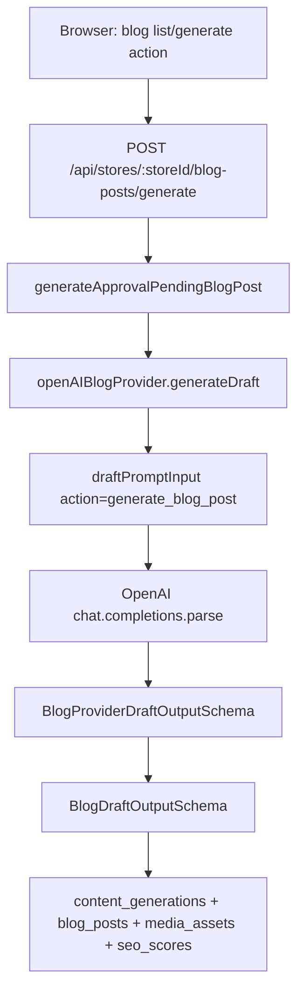
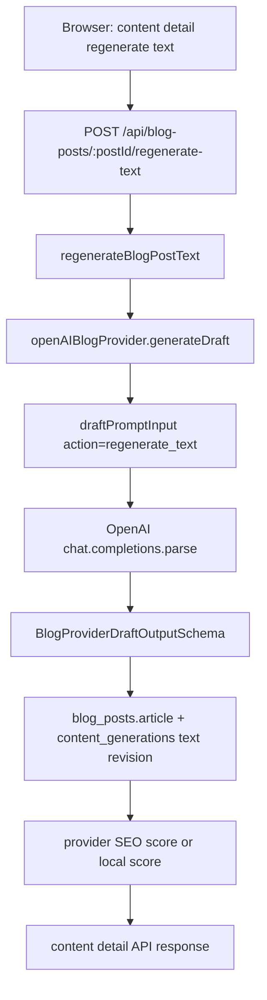
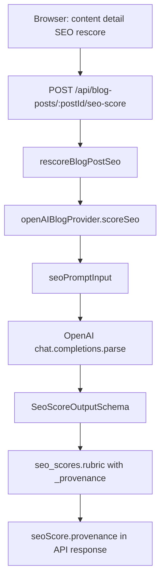
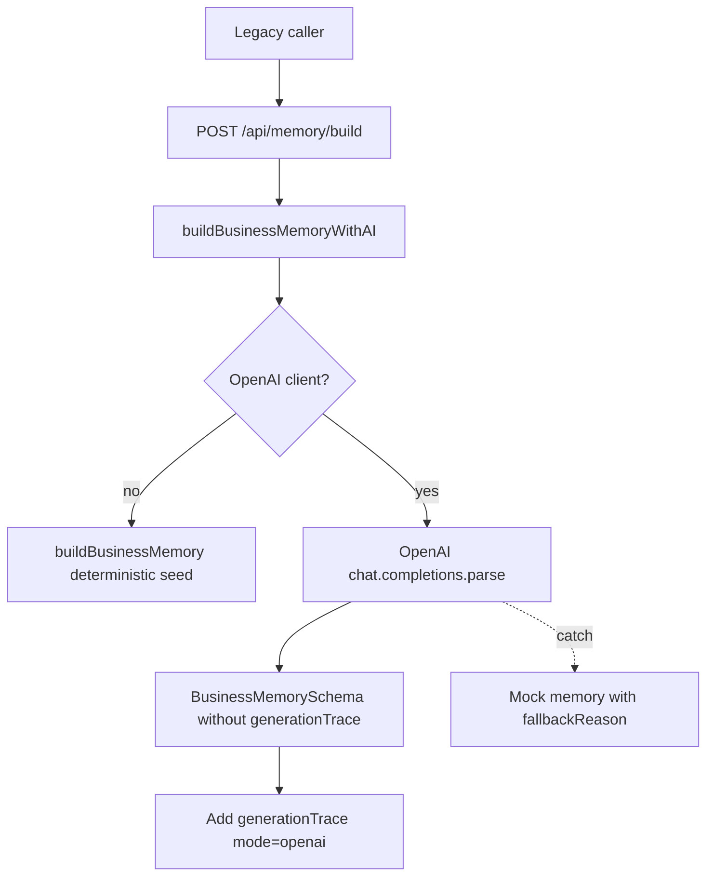
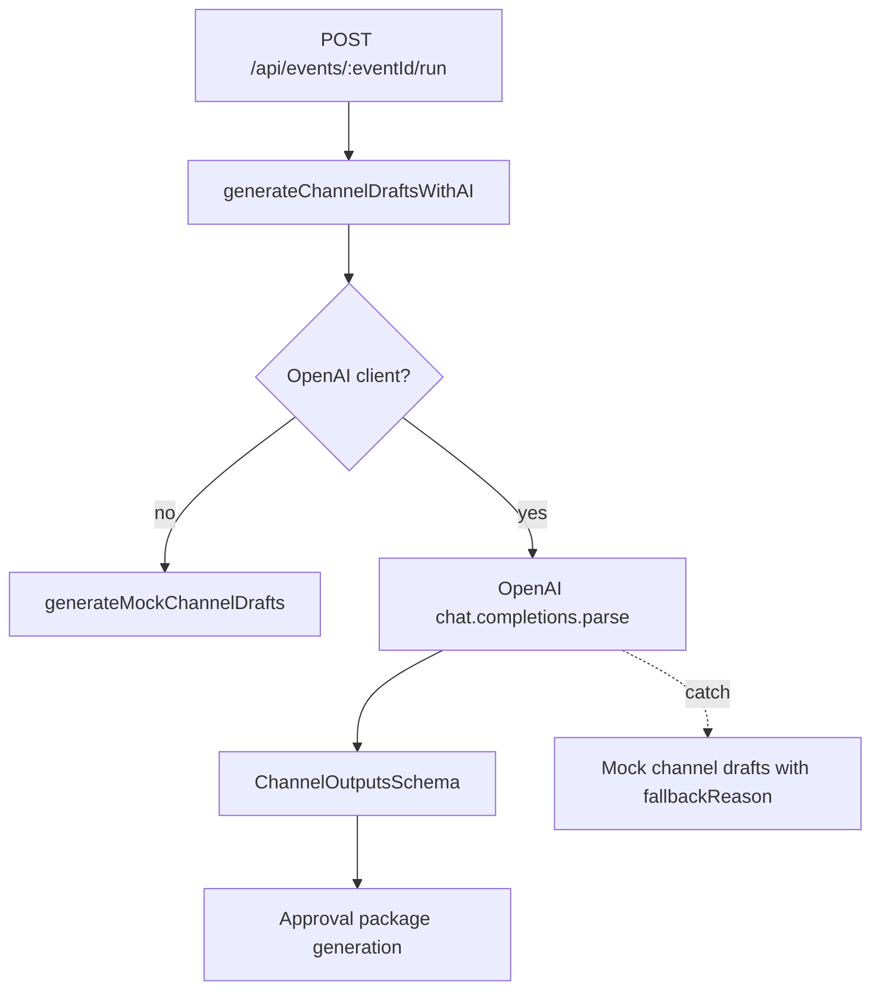

# LLM Call Structures

> **Scope:** This document describes the current server-side OpenAI call
> structures in this repository. Browser pages must call `poc-server` APIs
> only; Naver/OpenAI credentials stay server-side.

**Current runtime model:** `process.env.OPENAI_MODEL ?? "gpt-4o-mini"`

**Current OpenAI client path:** `poc-server/src/ai/openaiClient.ts`

**Not LLM calls:** ruleset preview regeneration, ruleset version restore,
similar-company benchmark fixture, image prompt regeneration, RAG document
generation, review-weakness backfill, static/server-derived writing-style
suggestions, and Blog Formula V2 deterministic/safe-mock extraction,
retrieval and validation do not call OpenAI. Blog Formula V2 draft generation
calls OpenAI only on the explicit `openai`/`auto` provider path (`SL-G1`); its
deterministic and safe-mock paths do not.

**Blog Formula V2 OpenAI calls:** Blog Formula V2 formula extraction (`SL-F1`)
and draft generation (`SL-G1`) call OpenAI only through `poc-server` when
`providerMode = "openai"` or `providerMode = "auto"` with a server-side
`OPENAI_API_KEY`. Missing `providerMode` and `providerMode = "deterministic"`
preserve the deterministic path, and explicit `openai` fails instead of
silently falling back when the server-side OpenAI client is unavailable.

---

## Call Inventory

| ID | Type | Product area | API / trigger | OpenAI method | Response contract |
|---|---|---|---|---|---|
| SL-A1 | Budgeted structured analysis | Store Learning | `POST /api/analysis-runs/:analysisRunId/start` | `client.beta.chat.completions.parse` | `AnalyzerOutputSchema` |
| SL-B1 | Structured blog draft generation | Store Learning Blog | `POST /api/stores/:storeId/blog-posts/generate` | `client.beta.chat.completions.parse` | `BlogProviderDraftOutputSchema` |
| SL-B2 | Structured blog text regeneration | Store Learning Blog | `POST /api/blog-posts/:postId/regenerate-text` | `client.beta.chat.completions.parse` | `BlogProviderDraftOutputSchema` |
| SL-S1 | Structured SEO scoring | Store Learning Blog | `POST /api/blog-posts/:postId/seo-score` | `client.beta.chat.completions.parse` | `SeoScoreOutputSchema` |
| SL-F1 | Structured formula extraction | Blog Formula V2 | `POST /api/stores/:storeId/v2/blog-formula/extract` with `providerMode = "openai"` or `auto` with key | `client.beta.chat.completions.parse` | `BlogFormulaSetV2Schema` |
| SL-G1 | Structured blog draft generation | Blog Formula V2 | `POST /api/stores/:storeId/v2/blog-formula/generate-draft` with `providerMode = "openai"` or `auto` with key | `client.beta.chat.completions.parse` | `BlogDraftModelResponseV2Schema` |
| RT-P1 | Runtime model probe | Runtime health | `POST /api/runtime/openai-probe` | `client.models.retrieve` | No prompt / no generated content |
| LEG-M1 | Legacy structured extraction | Event-to-Operation legacy | `POST /api/memory/build` | `client.beta.chat.completions.parse` | `BusinessMemorySchema.omit({ generationTrace: true })` |
| LEG-C1 | Legacy structured channel generation | Event-to-Operation legacy | `POST /api/events/:eventId/run` | `client.beta.chat.completions.parse` | `ChannelOutputsSchema` |

---

## Server-Side LLM Audit Logs

Store Learning OpenAI paths now write server-side rows to
`llm_audit_logs`. This is an internal SQLite inspection table, not a
customer-facing browser surface. Browser pages still call only `poc-server`
APIs, and OpenAI credentials stay server-side.

Each row records:

- `store_id`
- `related_entity_type`: `analysis_run`, `content_generation`, `blog_post`,
  or `seo_score`
- `related_entity_id` when an artifact exists; failed pre-artifact Blog/SEO
  calls may store `NULL`
- `provider`, `mode`, `model`, and action
- `request_started_at`, `response_completed_at`, and `duration_ms`
- `input_budget_json`
- `prompt_input_json`: the exact compact/budgeted server prompt input
- `response_format_json`: compact schema metadata such as response format name
  and strict mode
- `parsed_output_json`: validated structured output or compact parsed output
- `status`: `completed` or `failed`
- `error_json`: sanitized product/developer metadata only

For local debugging, inspect the latest rows with SQLite, for example:

```sql
SELECT
  created_at,
  store_id,
  related_entity_type,
  related_entity_id,
  provider,
  model,
  action,
  status,
  duration_ms
FROM llm_audit_logs
ORDER BY created_at DESC
LIMIT 10;
```

`prompt_input_json` can include collected Blog/review text after server-side
budgeting. Do not expose this table through customer-facing HTML, screenshots,
query strings, or localStorage. The table must not store API keys, OpenAI raw
HTTP headers, or raw SDK response objects.

Ruleset version restore is intentionally absent from `llm_audit_logs`: it
copies a selected historical `marketing_rulesets` row and its `ruleset_fields`
into a new `draft` version, records restore metadata in
`marketing_rulesets.ruleset`, and does not call OpenAI or create an
`analysis_run`.

---

## Type SL-F1: Blog Formula V2 Structured Formula Extraction

**Call ID:** `SL-F1`

**Purpose:** Extract a reusable Blog Formula V2 style formula from collected
owner Blog posts only.

**Provider:** `openAIBlogFormulaV2Provider`

**Key files:**

- `poc-server/src/storeLearning/blogFormulaV2/blogFormulaPrompt.ts`
- `poc-server/src/storeLearning/blogFormulaV2/providers/openAIBlogFormulaProvider.ts`
- `poc-server/src/storeLearning/blogFormulaV2/providers/providerFactory.ts`
- `poc-server/src/storeLearning/blogFormulaV2/blogFormulaV2Service.ts`
- `poc-server/src/storeLearning/routes/blogFormulaV2.ts`

**Provider modes on `POST /extract`:**

- missing or `deterministic`: existing deterministic V2 extraction, no
  OpenAI, no `llm_audit_logs` row.
- `safe_mock`: provider-shaped path with no external calls, no
  `llm_audit_logs` row.
- `openai`: explicit server-side OpenAI extraction; if the server-side OpenAI
  client is unavailable, the V2 run is stored as `failed` and no formula set is
  created.
- `auto`: uses OpenAI when `OPENAI_API_KEY` is configured server-side, else
  uses `safe_mock`.

**Response format:**

```ts
zodResponseFormat(BlogFormulaSetV2Schema, "store_learning_blog_formula_v2")
```

The response contract is the generation-ready `blog_formula_v2.1`
`BlogFormulaSetV2Schema`: a slot-based `titleFormula` array (placeholder
patterns like `{지역키워드}{시술명}`), `introFormula`/`bodyFormula`/
`footerFormula` as writing-move sequences, `toneAndMannerFormula` as reusable
sentence habits (persona, preferred phrases, endings, empathy patterns, emoji
policy), `ctaFormula` as a soft decision-guide pattern distinguished from a
hard reservation CTA, and `medicalSafetyFormula` distinguishing banned claims
from required risk disclosures. Each block carries `sourcePostIds`,
`confidence`, and `status: confirmed | candidate | weak`. Legacy
`blog_formula_v2.0` stored formulas are upgraded on read via
`parseStoredBlogFormulaV2`.

**System prompt:**

```text
You are a Korean local-store blog writing-formula analyst. Your output is a generation-ready writing formula, not a generic marketing summary. It will be consumed directly by a deterministic draft generator together with a Topic Brief and retrieved owner Blog style examples Top 1~3. Each formula block must describe how to write, not what to say. Produce slot-based title patterns from actual titles, intro/body/footer sequences of writing moves from actual body flow, tone as reusable sentence habits (persona, preferred phrases, endings, emoji policy), a soft decision-guide CTA pattern distinguished from hard reservation CTA, and medical safety constraints distinguishing banned claims from required risk disclosures. Use only the provided owner Blog posts as evidence, attach sourcePostIds per block, mark single-post patterns as candidate or weak and repeated patterns as confirmed, do not copy long source text, and keep medical, legal, and guarantee claims conservative.
```

**Prompt input shape:**

```ts
{
  task: "Extract Blog Formula V2 from owner Blog posts.",
  schemaVersion: "blog_formula_v2_extraction_input.v2",
  outputSchemaRef: "blog_formula_v2.1",
  constraints: string[],
  productIntent: string[],
  formulaExtractionInstructions: string[],
  formulaQualityRequirements: string[],
  storeProfile: { id, name, category, address },
  sourcePostIds: string[],
  ownerBlogPosts: [
    {
      id,
      title,
      sourceUrl,
      publishedAt,
      charCount,
      includedCharCount,
      isTruncated,
      bodyText
    }
  ],
  requestedFormulaBlocks: [
    "titleFormula",
    "introFormula",
    "bodyFormula",
    "headingFormula",
    "toneAndMannerFormula",
    "ctaFormula",
    "footerFormula",
    "medicalSafetyFormula"
  ]
}
```

`productIntent` states the Formula Set must be generation-ready and directly
consumable by the existing V2 deterministic draft generator alongside a Topic
Brief and retrieved owner Blog style examples Top 1~3.
`formulaExtractionInstructions` and `formulaQualityRequirements` give
block-by-block extraction and concreteness rules (slot-based titles, move
sequences, sentence-habit tone, soft-vs-hard CTA, banned-vs-required safety
claims) so the model does not fall back to generic marketing language.

Prompt builder defaults:

- max 8 latest owner Blog posts
- max 3,500 body characters per post
- max 18,000 aggregate body characters
- max 30,000 serialized prompt characters

**Audit behavior:**

OpenAI extraction records `llm_audit_logs` with:

- `related_entity_type = "v2_blog_formula_run"`
- `related_entity_id = v2_blog_formula_runs.id`
- `action = "blog_formula_v2_extract"`
- `prompt_input_json`, `response_format_json`, raw requested JSON, raw parsed
  output, normalized output when schema-valid, and sanitized error metadata

Invalid OpenAI output is rejected by `BlogFormulaSetV2Schema`; the server
stores a failed `v2_blog_formula_runs` row with `formula_set_id = NULL`, does
not create a V2 formula set, and records a failed audit row.

---

## Type SL-G1: Blog Formula V2 Structured Draft Generation

**Call ID:** `SL-G1`

**Purpose:** Generate a new Korean Naver Blog draft by applying an extracted
Blog Formula V2 formula set, the topic brief, and the retrieved owner Blog
style examples Top 1~3.

**Provider:** `openAIBlogDraftV2Provider`

**Key files:**

- `poc-server/src/storeLearning/blogFormulaV2/blogDraftPrompt.ts`
- `poc-server/src/storeLearning/blogFormulaV2/draftOutput.ts`
- `poc-server/src/storeLearning/blogFormulaV2/providers/openAIBlogDraftProvider.ts`
- `poc-server/src/storeLearning/blogFormulaV2/providers/safeMockBlogDraftProvider.ts`
- `poc-server/src/storeLearning/blogFormulaV2/providers/draftProviderFactory.ts`
- `poc-server/src/storeLearning/blogFormulaV2/blogFormulaV2Service.ts`
- `poc-server/src/storeLearning/routes/blogFormulaV2.ts`

**Provider modes on `POST /generate-draft`:**

- missing or `deterministic`: existing deterministic V2 draft generation, no
  OpenAI, no `llm_audit_logs` row.
- `safe_mock`: provider-shaped path with no external calls, no
  `llm_audit_logs` row. Returns deterministic creative content plus a mock
  self-report.
- `openai`: explicit server-side OpenAI draft generation; if the server-side
  OpenAI client is unavailable, the draft generation is stored as `failed` and
  a failed audit row is recorded.
- `auto`: uses OpenAI when `OPENAI_API_KEY` is configured server-side, else
  uses `safe_mock`.

**Response format:**

```ts
zodResponseFormat(BlogDraftModelResponseV2Schema, "store_learning_blog_formula_v2_draft")
```

The model returns only what a model can meaningfully self-report:
`titleCandidates`, `selectedTitle`, `blogDraft`, and its own
`styleComplianceReport.appliedBlocks` / `safetyCheck` / `seoCheck`. Server-only
facts (`formulaSetId`, `sourcePostIds`) are not requested from the model. The
schema intentionally avoids array min/max constraints to stay compatible with
OpenAI structured outputs.

**Two-report comparison contract:**

The persisted draft `output` (`BlogDraftOutputV2`) keeps the existing contract
and adds an optional `modelReportedCompliance`:

- `output.styleComplianceReport` / `safetyCheck` / `seoCheck` are
  **server-derived authoritative** reports, computed by `deriveDraftReports`
  from the formula set, topic brief, and the generated title/body.
  `safetyCheck.bannedPhrasesAvoided` is computed by scanning the draft against
  `medicalSafetyFormula.bannedClaims`.
- `output.modelReportedCompliance` carries the **model's self-reported**
  versions of the same three reports for human comparison. It is `null` on the
  deterministic path.

`validate-draft` stays the deterministic quality gate over the generated
draft (build-first: persist then flag).

**System prompt:**

```text
You are a Korean local-store blog content strategist. You write a NEW Naver Blog draft by applying the provided Blog Formula V2 writing formula, a Topic Brief, and retrieved owner Blog style examples Top 1~3. The formula tells you HOW this store writes (title slots, intro/body/footer move sequences, heading style, tone habits, soft CTA, footer/disclaimer, medical safety); reproduce that style for the new topic. Use the style examples for structure and tone only — never copy their sentences. Place the main keyword in the title and first paragraph, weave secondary keywords in naturally, include the required medical disclosures, and never use banned claims or the brief mustAvoid phrases. Do not hardcode operating hours or invent treatment outcomes, rankings, or guarantees. Return validated structured draft data only; keep the draft approval-pending.
```

**Prompt input shape:**

```ts
{
  task: "Write a new Korean Naver Blog draft by applying the Blog Formula V2.",
  schemaVersion: "blog_formula_v2_draft_input.v1",
  outputSchemaRef: "store_learning_blog_formula_v2_draft",
  constraints: string[],
  productIntent: string[],
  generationInstructions: string[],
  qualityRequirements: string[],
  storeProfile: { id, name, category, address },
  formula: BlogFormulaSetV2,
  topicBrief: BlogTopicBriefInput,
  styleSamples: [
    { rank, collectionItemId, title, sourceUrl, whySelected, charCount, includedCharCount, isTruncated, bodyText }
  ],
  requestedOutputBlocks: [
    "titleCandidates", "selectedTitle", "blogDraft",
    "styleComplianceReport", "safetyCheck", "seoCheck"
  ]
}
```

Prompt builder defaults:

- max 3 style samples (the retrieval Top 1~3)
- max 2,500 body characters per sample
- max 7,500 aggregate sample body characters
- max 30,000 serialized prompt characters

`metadata` records `sampleCount`, `promptSampleCount`,
`omittedSampleCollectionItemIds`, `promptCharacterCount`, and a
`promptBudgetReason`.

**Audit behavior:**

OpenAI draft generation records `llm_audit_logs` with:

- `related_entity_type = "v2_blog_draft_generation"`
- `related_entity_id = v2_blog_draft_generations.id`
- `action = "blog_formula_v2_generate_draft"`
- `prompt_input_json`, `response_format_json`, raw requested JSON, raw parsed
  output, normalized output when schema-valid, and sanitized error metadata

Invalid OpenAI output is rejected by `BlogDraftModelResponseV2Schema`; the
server stores a `failed` `v2_blog_draft_generations` row (null
`selected_title`/`blog_draft`), records a failed audit row, and rethrows.

---

## Type 1: Budgeted Structured Analysis

**Call ID:** `SL-A1`

**Purpose:** Analyze selected Store Learning collection items and generate
learning snapshot, evidence rows, marketing ruleset, and ruleset fields.

**Provider:** `openAIAnalysisProvider`

**Key files:**

- `poc-server/src/storeLearning/analysis/openAIAnalysisProvider.ts`
- `poc-server/src/storeLearning/analysis/analysisPromptBudget.ts`
- `poc-server/src/storeLearning/analysis/analysisExecutionService.ts`
- `poc-server/src/storeLearning/routes/analysisRuns.ts`

**Current budget behavior:**

- Store facts are canonicalized once under `storeProfile.facts`.
- Item metadata is reduced to allowlisted metadata fields.
- Blog body text is no longer capped at a fixed per-item 1,200 characters;
  the latest 3 Blog posts fit against the aggregate body budget and include
  content completeness metadata.
- Place review body is capped at 500 characters per item.
- Place profile body is excluded; normalized facts are used instead.
- Current development version sends at most 3 latest Blog sources and 10 latest
  Place review sources with usable review text.
- Blog sources include server-computed SOP metrics (`styleMetrics`) and
  block-level text structure so the analyzer can learn title/intro/body,
  heading, symbol, hashtag, CTA, and keyword-placement patterns without
  inventing parser facts.
- Prompt root includes `computedAggregates` for length policy, symbol policy,
  hashtag candidates, CTA candidates, and heading/block statistics.
- Prompt JSON is capped by `DEFAULT_PROMPT_CHARACTER_BUDGET = 60000`.
- Aggregate body text is capped by `DEFAULT_BODY_CHARACTER_BUDGET = 32000`.
- Review-derived ruleset fields are blocked server-side in `blockedFields` only
  when usable review text is unavailable. Instagram and image-style ruleset
  fields are excluded from the active analyzer contract.

**Ruleset regeneration gate:** for stores that already have a learning
snapshot and marketing ruleset, `SL-A1` full analyzer regeneration is allowed
only when the current explicit meaningful-change collection contains at least
3 new Blog post assets and 10 new Place review assets. If either threshold is
missing, the server creates a completed skipped analysis run with
`skippedReason = "insufficient_new_evidence_for_ruleset_regeneration"`,
required/new evidence counts, `reusedAnalysisRunId`, `learningSnapshotId`, and
`marketingRulesetId`; it reuses the latest artifacts and does not call OpenAI
or create a new `llm_audit_logs` row. Initial learning, no-change reuse, and
Place profile-only reuse/backfill paths remain separate.



### System Prompt

```text
You are a Korean local-store marketing strategist. Analyze collected blog/place evidence and return a strict JSON ruleset. Use only provided collection items as evidence. Avoid unsupported superlatives and medical/legal/guarantee claims.
```

### User Prompt Shape

```ts
{
  task: "Analyze selected collected content for Store Learning & Blog Content Automation PoC.",
  schemaVersion: "sl_a1_blog_sop_input.v2",
  outputSchemaRef: "store_learning_analysis.v2",
  constraints: [
    "Return Korean marketing strategy analysis only.",
    "Every evidence.collectionItemId must be one of the provided evidenceItemIds.",
    "Every requested ruleset field evidenceItemIds entry must be one of the provided evidenceItemIds.",
    "Do not invent customer reviews or collection items.",
    "Keep claims conservative and evidence-linked.",
    "Populate every requested ruleset field once; do not populate blocked fields."
  ],
  storeProfile: {
    id,
    sourceItemIds: string[],
    facts: {
      name,
      category,
      address,
      phone,
      description,
      businessHours,
      closedDays,
      parking,
      intro,
      treatmentSubjects,
      representativeTreatmentSubjects,
      representativeMenu
    }
  },
  evidenceItemIds: string[],
  blogPosts: [
    {
      id,
      title,
      sourceUrl,
      metadata: {
        publishedAt,
        postDate,
        bodyAvailability,
        sourceKind,
        sourceOwnership,
        blogId,
        logNo,
        tags
      },
      content: {
        bodyTextFull,
        charCount,
        includedCharCount,
        isTruncated,
        bodyCompleteness,
        truncationReason,
        contentHash,
        bodyAvailability,
        blocks: [{ type: "heading" | "paragraph", text, index }],
        styleMetrics: {
          characterCount,
          paragraphCount,
          headingLikeLineCount,
          questionSentenceCount,
          hashtagCount,
          emojiCount,
          symbolCount,
          ctaCandidateCount,
          averageParagraphLength
        },
        hasHashtags,
        questionSentenceCount,
        ctaCandidates
      }
    }
  ],
  reviews: [
    {
      id,
      title,
      sourceUrl,
      metadata: {
        reviewDate,
        rating,
        reviewerName,
        bodyAvailability,
        sourceKind,
        sourceOwnership
      },
      content: {
        bodyText,
        charCount,
        includedCharCount,
        isTruncated,
        bodyCompleteness,
        truncationReason,
        contentHash,
        bodyAvailability
      }
    }
  ],
  unavailableData: {
    reviews: boolean
  },
  computedAggregates: {
    blogPostCount,
    averageBodyCharacterCount,
    averageParagraphCount,
    averageHeadingLikeLineCount,
    hashtagCandidates,
    ctaCandidates,
    lengthPolicy,
    symbolPolicy,
    headingPolicy
  },
  requestedRulesetFieldKeys: string[],
  requestedRulesetFields: [
    {
      fieldKey,
      label,
      section,
      valueKind,
      sourceTier,
      inputSources,
      expectedOutput,
      evidenceGuidance
    }
  ],
  blockedFields: [
    {
      fieldKey,
      label,
      section,
      reason: "review_text_unavailable",
      source: "input_blocked"
    }
  ],
  industryPolicy: {
    isHealthcare,
    signals,
    requiredRules
  }
}
```

`requestedRulesetFields` is built from the AI source matrix after input
planning. Direct Place/manual facts such as `operatingHours`, `closedDays`, and
`parking` stay direct and are not included as LLM-generated ruleset fields.
The brand-analysis representative offering row uses the `representativeMenu`
contract; healthcare screens only relabel that row as 대표 진료과목. For
brand-analysis fields above review strengths/weaknesses, field evidence is
scoped to Blog post IDs. `reviewStrength` and `reviewWeakness` are scoped to
Place review IDs and are blocked when there is no usable collected review text.
The core Blog SOP fields are `keywordMap`, `titlePatterns`, `introPattern`,
`bodyOutlinePattern`, `headingPattern`, and `seoPlacementPolicy`; these are
generated from Blog titles/body, store facts, and computed aggregates. Parser
fields such as `blogPreferredLength` and `blogEmojiPolicy` are treated as
server-computed policy inputs rather than free-form analyzer invention.
Instagram and image-style fields are not part of the active Blog SOP analyzer
input/output contract. Their previous prompt and schema pieces are archived in
`docs/codex/DEFERRED_INSTAGRAM_IMAGE_CONTRACT.md` for later reintroduction.

### Response Handling



The OpenAI provider requests `rulesetFieldsByKey`, a field-keyed object where
only `requestedRulesetFieldKeys` are required. Evidence IDs in the structured
response are constrained to `evidenceItemIds`, the IDs that actually appear in
the budgeted prompt payload. The provider normalizes requested keys to
internal `rulesetFields[]` with `source = "openai_analysis"`. The analysis
execution service appends server-created blocked fields with
`source = "input_blocked"`, empty `evidenceItemIds`, `confidence = null`, and
a Korean `finalValue` explaining why the field was not inferred. Before
persistence, `SL-A1` rejects duplicate/unknown/source mismatches and
revalidates all evidence item references. A failure at this stage marks the
analysis run as failed and saves no evidence, snapshot, marketing ruleset, or
ruleset fields.

**Stored metadata:** `analysis_runs.result` stores
`analyzerProvider`, `analyzerMode`, `analyzerModel`, selected/prompt/omitted
counts, Blog limit/counts, review limit/counts, character budgets, and
`promptBudgetReason`. `llm_audit_logs.prompt_input_json` stores the v2
budgeted input (`schemaVersion`, `storeProfile`, `evidenceItemIds`,
`blogPosts`, `computedAggregates`, `reviews`, `requestedRulesetFieldKeys`,
`blockedFields`, and `industryPolicy`) and may include Blog body text after
server-side budgeting.
Current development defaults include at most 3 Blog items and at most 10 Place
review items in the SL-A1 prompt.

**Failure handling:** context-length errors are sanitized as
`errorType: "analysis_context_too_large"` with a Korean product message.
Ruleset field contract failures are sanitized as
`errorType: "analysis_contract_invalid"` with `contractIssue` metadata, and
raw fieldKey lists are not stored in `analysis_runs.error` or returned to the
browser.

---

## Type 2: Structured Blog Draft Generation

**Call ID:** `SL-B1`

**Purpose:** Generate an approval-pending Naver Blog draft and image prompts
from the current marketing ruleset.

**Provider:** `openAIBlogProvider.generateDraft`

**Key files:**

- `poc-server/src/storeLearning/blog/openAIBlogProvider.ts`
- `poc-server/src/storeLearning/blog/blogPromptBudget.ts`
- `poc-server/src/storeLearning/blog/blogGenerator.ts`
- `poc-server/src/storeLearning/routes/stores.ts`

**Current budget behavior:** `buildBlogDraftPromptInput()` compacts the OpenAI
prompt before serialization. Store metadata is allowlisted, ruleset JSON is
reduced to an allowlisted summary plus compact ruleset fields, ruleset field
values are capped, media assets are limited, and prompt budget metadata is
recorded as `inputBudget`. If the serialized prompt still exceeds the
configured budget, the builder progressively reduces media asset count, article
section count/body length, and ruleset field value length until it fits or
reaches minimum context. Only Blog/SEO-relevant ruleset field keys are included.



### System Prompt

```text
You are a Korean local-store blog content strategist. Return validated structured blog draft data only. Follow the ruleset, keep claims evidence-safe, and produce image prompts instead of image assets.
```

### User Prompt Shape

```ts
{
  task: "Generate a Korean approval-pending Naver Blog article draft for the store.",
  constraints: [
    "Return only structured data matching the requested schema.",
    "Use Korean copy suitable for a local-store Naver Blog post.",
    "Respect the current marketing ruleset and avoid forbidden or exaggerated expressions.",
    "Do not claim unsupported facts, discounts, guarantees, medical effects, or official rankings.",
    "Do not imply Naver top-ranking guarantees or claim algorithmic ranking outcomes.",
    "Image generation is out of scope; return image prompts only.",
    "Keep the draft approval-pending and do not include publishing instructions."
  ],
  store: {
    id,
    name,
    category,
    address,
    phone,
    description,
    metadata // allowlisted profile facts only
  },
  ruleset: {
    id,
    status,
    version,
    summary, // allowlisted ruleset summary only
    fields: [{ fieldKey, finalValue, source, locked }]
  },
  rulesetFields: [
    {
      fieldKey, // includes Blog SOP fields such as keywordMap, titlePatterns, introPattern, bodyOutlinePattern, headingPattern, seoPlacementPolicy
      finalValue,
      source,
      locked
    }
  ],
  currentPost: null,
  mediaAssets: []
}
```

### Response Shape

```ts
{
  title: string,
  metaDescription: string,
  bodySections: Array<{ heading: string, body: string }>,
  seoKeywords: string[],
  cta: string,
  imagePrompts: string[],
  seoScore: SeoScoreOutput | null
}
```

**Stored provenance:** `content_generations.prompt` stores mode, provider,
model, action, providerSeoScoreReturned, `inputBudget`, generator, rulesetId,
and fieldKeys. The database column is `prompt_json`. The generation API
response also exposes the same content metadata as `contentProvenance`, and
the initial SEO score separates provider metadata into `seoScore.provenance`.

**Fallback:** if no provider is created, `buildDraft()` creates a deterministic
mock draft that uses title patterns, body outline patterns, heading policy,
keyword placement policy, and the 소재-키워드 맵 when present. Context-length
provider errors are sanitized to a Korean product message before they reach
route error responses.

---

## Type 3: Structured Blog Text Regeneration

**Call ID:** `SL-B2`

**Purpose:** Regenerate an existing approval-pending Blog article using the
same `generateDraft` provider method with `action = "regenerate_text"`.

**Provider:** `openAIBlogProvider.generateDraft`

**Key files:**

- `poc-server/src/storeLearning/blog/openAIBlogProvider.ts`
- `poc-server/src/storeLearning/blog/blogPromptBudget.ts`
- `poc-server/src/storeLearning/blog/blogGenerator.ts`
- `poc-server/src/storeLearning/routes/blogPosts.ts`

**Current budget behavior:** `buildBlogDraftPromptInput()` uses the same compact
store/ruleset shape as `SL-B1`, compacts `currentPost.article` to title, meta,
bounded body sections/body text, keywords, CTA, and image prompts, and
allowlists media asset metadata.



### System Prompt

Same as `SL-B1`.

```text
You are a Korean local-store blog content strategist. Return validated structured blog draft data only. Follow the ruleset, keep claims evidence-safe, and produce image prompts instead of image assets.
```

### User Prompt Shape

```ts
{
  task: "Regenerate a Korean approval-pending Naver Blog article draft for the store.",
  constraints: [
    "Return only structured data matching the requested schema.",
    "Use Korean copy suitable for a local-store Naver Blog post.",
    "Respect the current marketing ruleset and avoid forbidden or exaggerated expressions.",
    "Do not claim unsupported facts, discounts, guarantees, medical effects, or official rankings.",
    "Do not imply Naver top-ranking guarantees or claim algorithmic ranking outcomes.",
    "Image generation is out of scope; return image prompts only.",
    "Keep the draft approval-pending and do not include publishing instructions."
  ],
  store: {
    id,
    name,
    category,
    address,
    phone,
    description,
    metadata // allowlisted profile facts only
  },
  ruleset: {
    id,
    status,
    version,
    summary,
    fields: [{ fieldKey, finalValue, source, locked }]
  },
  rulesetFields: [
    {
      fieldKey,
      finalValue,
      source,
      locked
    }
  ],
  currentPost: {
    id,
    status,
    title,
    article: {
      title,
      metaDescription,
      bodySections, // bounded section count and body length
      bodyText,
      seoKeywords,
      cta,
      imagePrompts
    }
  },
  mediaAssets: [
    {
      id,
      assetType,
      status,
      prompt,
      metadata // prompt, alt, placement, generator only
    }
  ]
}
```

**Stored provenance:** a new `content_generations` row is created with
`contentType = "blog_post_text_revision"`. `inputBudget` is stored in
`content_generations.prompt` and exposed through `contentProvenance`.
SEO provenance is stored under `seo_scores.rubric._provenance` and serialized
as `seoScore.provenance`. The content detail UI renders provider, model,
action, and prompt input character budget in its compact provenance line.

**Fallback:** if no provider is created, local mock revision content is built.
Context-length provider errors are sanitized to a Korean product message.

---

## Type 4: Structured SEO Scoring

**Call ID:** `SL-S1`

**Purpose:** Score the current Blog draft for Naver Blog SEO and approval
readiness.

**Provider:** `openAIBlogProvider.scoreSeo`

**Key files:**

- `poc-server/src/storeLearning/blog/openAIBlogProvider.ts`
- `poc-server/src/storeLearning/blog/blogPromptBudget.ts`
- `poc-server/src/storeLearning/blog/blogGenerator.ts`
- `poc-server/src/storeLearning/routes/blogPosts.ts`

**Current budget behavior:** `buildBlogSeoPromptInput()` compacts the post
article to bounded article fields, uses the compact ruleset/ruleset field shape,
allowlists media asset metadata, and records `inputBudget` in SEO provenance.
It uses the same progressive fit loop and Blog/SEO-relevant ruleset field
allowlist as `SL-B1`/`SL-B2`.



### System Prompt

```text
You are a Korean Naver Blog SEO reviewer. Return strict structured SEO scoring only. Use the rubric fields exactly and do not rewrite the article.
```

### User Prompt Shape

```ts
{
  task: "Score this Korean Naver Blog draft for SEO and approval readiness.",
  constraints: [
    "Return only structured SEO scores matching the requested schema.",
    "Score conservatively using the provided article, image prompts, and marketing ruleset.",
    "Do not reward or imply Naver top-ranking guarantees or algorithmic ranking outcomes.",
    "Do not rewrite the article in this response."
  ],
  store: {
    id,
    name,
    category,
    address
  },
  ruleset: {
    id,
    status,
    version,
    summary,
    fields: [{ fieldKey, finalValue, source, locked }]
  } | null,
  rulesetFields: [
    {
      fieldKey,
      finalValue,
      source,
      locked
    }
  ],
  post: {
    id,
    status,
    title,
    article: {
      title,
      metaDescription,
      bodySections,
      bodyText,
      seoKeywords,
      cta,
      imagePrompts
    }
  },
  mediaAssets: [
    {
      id,
      assetType,
      status,
      prompt,
      metadata // prompt, alt, placement, generator only
    }
  ]
}
```

### Response Shape

```ts
{
  totalScore: number,
  rubric: {
    titleKeyword: SeoScoreItem,
    bodyKeyword: SeoScoreItem,
    metaDescription: SeoScoreItem,
    readability: SeoScoreItem,
    imageAltPrompt: SeoScoreItem,
    cta: SeoScoreItem
  }
}
```

**Stored provenance:** provider/mode/model/action and `inputBudget` are stored
in `seo_scores.rubric._provenance`, then separated into `seoScore.provenance`
in API responses. The content detail UI renders the SEO provider, model,
action, and prompt input character budget in its compact provenance line.

**Fallback:** if no provider is created, `scoreBlogPost()` computes a
deterministic local score. Context-length provider errors are sanitized to a
Korean product message.

---

## Type 5: Runtime Model Probe

**Call ID:** `RT-P1`

**Purpose:** Check whether the configured OpenAI model can be retrieved.
This does not generate content and has no prompt.

**Key files:**

- `poc-server/src/ai/runtimeHealth.ts`
- `poc-server/src/index.ts`

```mermaid
flowchart TD
  BrowserOrCurl[Browser/curl] --> API[POST /api/runtime/openai-probe]
  API --> Runtime[probeOpenAIRuntime]
  Runtime --> Status[getRuntimeStatus]
  Status --> Client[getOpenAIClient]
  Client --> Retrieve[OpenAI models.retrieve(model)]
  Retrieve --> Probe[ok/message response]
```

### Request Shape

No prompt is sent. The only provider input is the model name.

```ts
{
  model: process.env.OPENAI_MODEL ?? "gpt-4o-mini"
}
```

### Response Shape

```ts
{
  mode: "mock" | "openai",
  openaiConfigured: boolean,
  model: string,
  checkedAt: string,
  ok: boolean,
  message: string
}
```

**Failure handling:** OpenAI secret-like strings in error messages are
redacted by `redactSecrets()`.

---

## Type 6: Legacy Structured Extraction

**Call ID:** `LEG-M1`

**Product status:** Legacy Event-to-Operation / cafe event flow. This is not
the Store Learning source of truth, but the server route still exists.

**Purpose:** Extract cafe business memory facts from pasted channel material.

**Key files:**

- `poc-server/src/workflows/buildBusinessMemory.ts`
- `poc-server/src/ai/prompts.ts`
- `poc-server/src/index.ts`



### System Prompt

```text
Extract cafe business memory facts from pasted channel material. Return a complete Korean cafe business memory JSON. Preserve factual channel material, infer only conservative marketing facts, and avoid unsupported claims.
```

### User Prompt Shape

```ts
{
  businessId: input.businessId ?? cafeSeedFixture.businessId,
  channelUrl: input.channelUrl ?? "",
  pastedText: input.pastedText ?? "",
  fallbackShape: cafeSeedFixture
}
```

### Response Contract

```ts
BusinessMemorySchema.omit({ generationTrace: true })
```

**Fallback:** missing client or provider error returns deterministic cafe seed
memory with `generationTrace.mode = "mock"` and `fallbackReason`.

---

## Type 7: Legacy Structured Channel Draft Generation

**Call ID:** `LEG-C1`

**Product status:** Legacy Event-to-Operation / cafe event flow. This is not
the Store Learning source of truth, but the server route still exists.

**Purpose:** Generate channel-specific Korean marketing drafts for a cafe
event.

**Key files:**

- `poc-server/src/workflows/generateChannelDrafts.ts`
- `poc-server/src/ai/prompts.ts`
- `poc-server/src/index.ts`



### System Prompt

```text
Generate channel-specific Korean marketing drafts from a cafe event. 카페 이벤트를 네이버 블로그, 네이버 플레이스, 비즈챗, 챗봇 채널 초안으로 생성한다. 모든 초안에는 메뉴명, 할인금액, 시작일, 종료일을 포함하고 금지어를 피한다.
```

### User Prompt Shape

```ts
{
  businessMemory: memory,
  event
}
```

### Response Contract

```ts
{
  blog: Array<{ title: string, body: string }>,
  place: Array<{ type: string, body: string }>,
  bizchat: Array<{
    messageType: string,
    target: string,
    sendTime: string,
    cta: string,
    body: string
  }>,
  chatbot: Array<{ question: string, answer: string }>
}
```

**Fallback:** missing client or provider error returns deterministic channel
drafts with `generationTrace.mode = "mock"` and `fallbackReason`.

---

## Current Gaps And Next Planning Targets

1. **Provider telemetry symmetry:** Analysis run metadata is still broader than
   Blog/SEO metadata because analysis tracks selected/prompt/omitted source
   item counts.
2. **Legacy route isolation:** Legacy Event-to-Operation calls are still
   server-reachable and should stay clearly separated from Store Learning
   validation.
