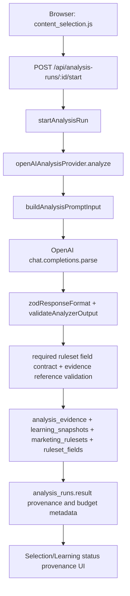
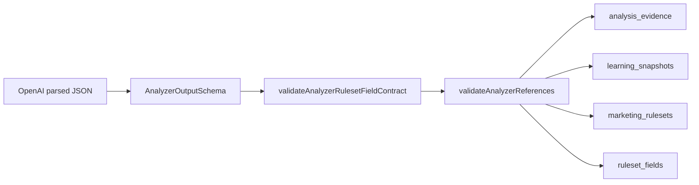
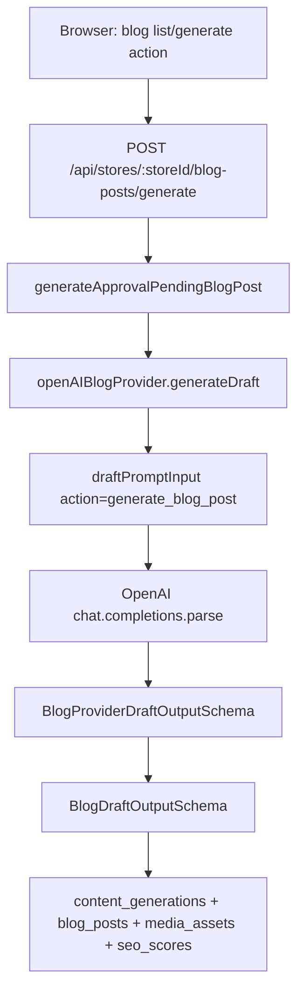
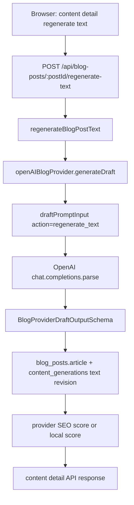
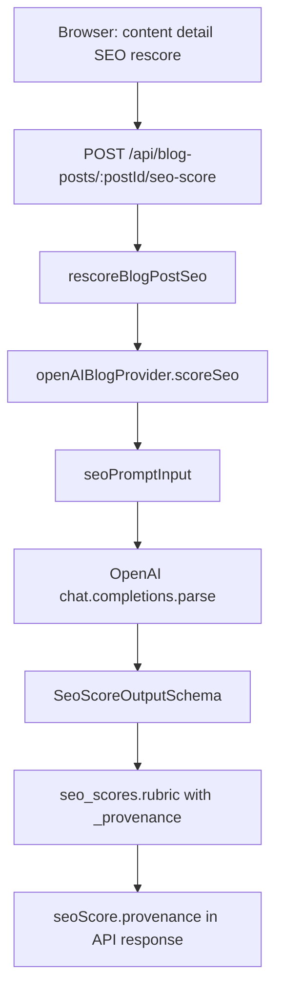
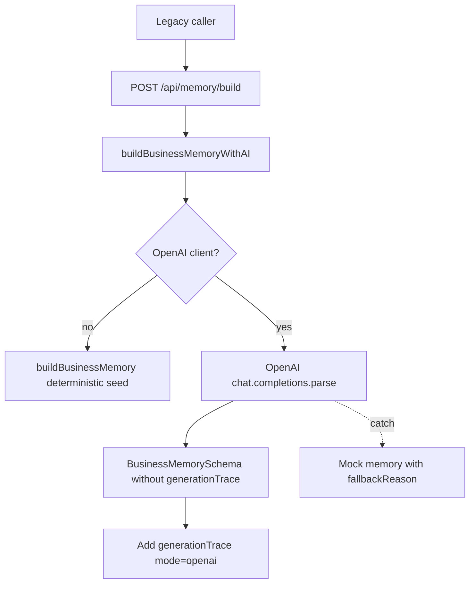
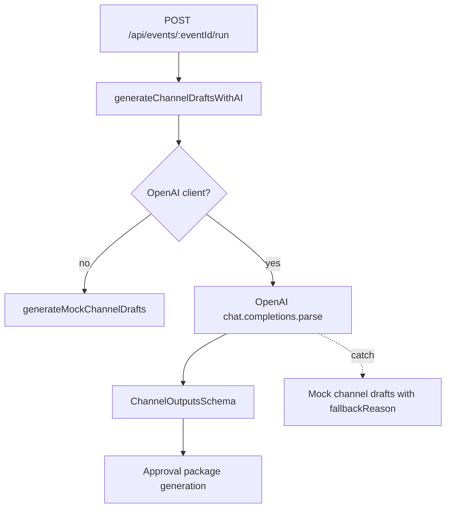

# LLM Call Structures

> **Scope:** This document describes the current server-side OpenAI call
> structures in this repository. Browser pages must call `poc-server` APIs
> only; Naver/OpenAI credentials stay server-side.

**Current runtime model:** `process.env.OPENAI_MODEL ?? "gpt-4o-mini"`

**Current OpenAI client path:** `poc-server/src/ai/openaiClient.ts`

**Not LLM calls:** ruleset preview regeneration, similar-company benchmark
fixture, image prompt regeneration, RAG document generation, review-weakness
backfill, and static/server-derived writing-style suggestions do not call
OpenAI in the current implementation.

---

## Call Inventory

| ID | Type | Product area | API / trigger | OpenAI method | Response contract |
|---|---|---|---|---|---|
| SL-A1 | Budgeted structured analysis | Store Learning | `POST /api/analysis-runs/:analysisRunId/start` | `client.beta.chat.completions.parse` | `AnalyzerOutputSchema` |
| SL-B1 | Structured blog draft generation | Store Learning Blog | `POST /api/stores/:storeId/blog-posts/generate` | `client.beta.chat.completions.parse` | `BlogProviderDraftOutputSchema` |
| SL-B2 | Structured blog text regeneration | Store Learning Blog | `POST /api/blog-posts/:postId/regenerate-text` | `client.beta.chat.completions.parse` | `BlogProviderDraftOutputSchema` |
| SL-S1 | Structured SEO scoring | Store Learning Blog | `POST /api/blog-posts/:postId/seo-score` | `client.beta.chat.completions.parse` | `SeoScoreOutputSchema` |
| RT-P1 | Runtime model probe | Runtime health | `POST /api/runtime/openai-probe` | `client.models.retrieve` | No prompt / no generated content |
| LEG-M1 | Legacy structured extraction | Event-to-Operation legacy | `POST /api/memory/build` | `client.beta.chat.completions.parse` | `BusinessMemorySchema.omit({ generationTrace: true })` |
| LEG-C1 | Legacy structured channel generation | Event-to-Operation legacy | `POST /api/events/:eventId/run` | `client.beta.chat.completions.parse` | `ChannelOutputsSchema` |

---

## Type 1: Budgeted Structured Analysis

**Call ID:** `SL-A1`

**Purpose:** Analyze selected Store Learning collection items and generate
learning snapshot, evidence rows, marketing ruleset, and ruleset fields.

**Provider:** `openAIAnalysisProvider`

**Key files:**

- `poc-server/src/storeLearning/analysis/openAIAnalysisProvider.ts`
- `poc-server/src/storeLearning/analysis/analysisPromptBudget.ts`
- `poc-server/src/storeLearning/analysis/analysisExecutionService.ts`
- `poc-server/src/storeLearning/routes/analysisRuns.ts`

**Current budget behavior:**

- Store metadata is reduced to allowlisted profile facts.
- Item metadata is reduced to allowlisted metadata fields.
- Blog body is capped at 1,200 characters per item.
- Place review body is capped at 500 characters per item.
- Place profile body is excluded; normalized facts are used instead.
- Current development version sends at most 10 latest Blog sources.
- Prompt JSON is capped by `DEFAULT_PROMPT_CHARACTER_BUDGET = 60000`.
- Aggregate body text is capped by `DEFAULT_BODY_CHARACTER_BUDGET = 32000`.



### System Prompt

```text
You are a Korean local-store marketing strategist. Analyze collected blog/place evidence and return a strict JSON ruleset. Use only provided collection items as evidence. Avoid unsupported superlatives and medical/legal/guarantee claims.
```

### User Prompt Shape

```ts
{
  task: "Analyze selected collected content for Store Learning & Blog Content Automation PoC.",
  constraints: [
    "Return Korean marketing strategy analysis only.",
    "Every evidence.collectionItemId must be one of the provided selected item IDs.",
    "Every rulesetFields[].evidenceItemIds entry must be one of the provided selected item IDs.",
    "Do not invent customer reviews or collection items.",
    "Keep claims conservative and evidence-linked.",
    "Use source=openai_analysis for generated ruleset fields."
  ],
  store: {
    id,
    name,
    category,
    address,
    description,
    metadata: {
      // allowlisted profile facts only:
      // category, address, phone, businessHours, closedDays,
      // parking, intro, description, treatmentSubjects,
      // representativeTreatmentSubjects, representativeMenu
    }
  },
  selectedItemIds: string[],
  selectedItems: [
    {
      id,
      channel,
      sourceType,
      title,
      bodyText, // budgeted, or null for profile items
      sourceUrl,
      metadata: {
        // allowlisted item metadata only:
        // publishedAt, postDate, reviewDate, rating,
        // reviewerName, bodyAvailability, sourceKind,
        // sourceOwnership, blogId, logNo, tags, profileFacts
      }
    }
  ],
  requiredRulesetFieldKeys: REQUIRED_ANALYZER_RULESET_FIELD_KEYS,
  requiredRulesetFields: [
    {
      fieldKey,
      label,
      section,
      valueKind,
      sourceTier,
      inputSources,
      expectedOutput,
      evidenceGuidance
    }
  ]
}
```

`requiredRulesetFields` is built from the AI source matrix only. Direct
Place/manual facts such as `operatingHours`, `closedDays`, `parking`, and
`representativeTreatmentSubjects` stay direct and are not included as
LLM-generated ruleset fields.

### Response Handling



Before persistence, `SL-A1` enforces that every
`REQUIRED_ANALYZER_RULESET_FIELD_KEYS` field appears exactly once in
`rulesetFields`, unknown field keys are rejected, OpenAI provider outputs use
`source = "openai_analysis"`, and all evidence item references point to the
selected collection items. A failure at this stage marks the analysis run as
failed and saves no evidence, snapshot, marketing ruleset, or ruleset fields.

**Stored metadata:** `analysis_runs.result` stores
`analyzerProvider`, `analyzerMode`, `analyzerModel`, selected/prompt/omitted
counts, Blog limit/counts, character budgets, and `promptBudgetReason`.

**Failure handling:** context-length errors are sanitized as
`errorType: "analysis_context_too_large"` with a Korean product message.

---

## Type 2: Structured Blog Draft Generation

**Call ID:** `SL-B1`

**Purpose:** Generate an approval-pending Naver Blog draft and image prompts
from the current marketing ruleset.

**Provider:** `openAIBlogProvider.generateDraft`

**Key files:**

- `poc-server/src/storeLearning/blog/openAIBlogProvider.ts`
- `poc-server/src/storeLearning/blog/blogGenerator.ts`
- `poc-server/src/storeLearning/routes/stores.ts`

**Current budget status:** No dedicated prompt budget builder exists yet.
`store.metadata` and `ruleset.ruleset` are passed through in full.



### System Prompt

```text
You are a Korean local-store blog content strategist. Return validated structured blog draft data only. Follow the ruleset, keep claims evidence-safe, and produce image prompts instead of image assets.
```

### User Prompt Shape

```ts
{
  task: "Generate a Korean approval-pending Naver Blog article draft for the store.",
  constraints: [
    "Return only structured data matching the requested schema.",
    "Use Korean copy suitable for a local-store Naver Blog post.",
    "Respect the current marketing ruleset and avoid forbidden or exaggerated expressions.",
    "Do not claim unsupported facts, discounts, guarantees, medical effects, or official rankings.",
    "Image generation is out of scope; return image prompts only.",
    "Keep the draft approval-pending and do not include publishing instructions."
  ],
  store: {
    id,
    name,
    category,
    address,
    description,
    metadata // full current store metadata
  },
  ruleset: ruleset.ruleset, // full current ruleset JSON
  rulesetFields: [
    {
      fieldKey,
      finalValue,
      source,
      locked
    }
  ],
  currentPost: null,
  mediaAssets: []
}
```

### Response Shape

```ts
{
  title: string,
  metaDescription: string,
  bodySections: Array<{ heading: string, body: string }>,
  seoKeywords: string[],
  cta: string,
  imagePrompts: string[],
  seoScore: SeoScoreOutput | null
}
```

**Stored provenance:** `content_generations.prompt` stores mode, provider,
model, action, providerSeoScoreReturned, generator, rulesetId, and fieldKeys.
The database column is `prompt_json`.

**Fallback:** if no provider is created, `buildDraft()` creates a deterministic
mock draft. Provider errors are not sanitized like analysis errors yet.

---

## Type 3: Structured Blog Text Regeneration

**Call ID:** `SL-B2`

**Purpose:** Regenerate an existing approval-pending Blog article using the
same `generateDraft` provider method with `action = "regenerate_text"`.

**Provider:** `openAIBlogProvider.generateDraft`

**Key files:**

- `poc-server/src/storeLearning/blog/openAIBlogProvider.ts`
- `poc-server/src/storeLearning/blog/blogGenerator.ts`
- `poc-server/src/storeLearning/routes/blogPosts.ts`

**Current budget status:** No dedicated prompt budget builder exists yet.
`currentPost.article`, `currentArticle`, and `mediaAssets.metadata` may be
large.



### System Prompt

Same as `SL-B1`.

```text
You are a Korean local-store blog content strategist. Return validated structured blog draft data only. Follow the ruleset, keep claims evidence-safe, and produce image prompts instead of image assets.
```

### User Prompt Shape

```ts
{
  task: "Regenerate a Korean approval-pending Naver Blog article draft for the store.",
  constraints: [
    "Return only structured data matching the requested schema.",
    "Use Korean copy suitable for a local-store Naver Blog post.",
    "Respect the current marketing ruleset and avoid forbidden or exaggerated expressions.",
    "Do not claim unsupported facts, discounts, guarantees, medical effects, or official rankings.",
    "Image generation is out of scope; return image prompts only.",
    "Keep the draft approval-pending and do not include publishing instructions."
  ],
  store: {
    id,
    name,
    category,
    address,
    description,
    metadata // full current store metadata
  },
  ruleset: ruleset.ruleset,
  rulesetFields: [
    {
      fieldKey,
      finalValue,
      source,
      locked
    }
  ],
  currentPost: {
    id,
    status,
    title,
    article: currentArticle ?? currentPost.article
  },
  mediaAssets: [
    {
      id,
      assetType,
      status,
      prompt,
      metadata
    }
  ]
}
```

**Stored provenance:** a new `content_generations` row is created with
`contentType = "blog_post_text_revision"`. SEO provenance is stored under
`seo_scores.rubric._provenance` and serialized as `seoScore.provenance`.

**Fallback:** if no provider is created, local mock revision content is built.
Provider errors are not sanitized like analysis errors yet.

---

## Type 4: Structured SEO Scoring

**Call ID:** `SL-S1`

**Purpose:** Score the current Blog draft for Naver Blog SEO and approval
readiness.

**Provider:** `openAIBlogProvider.scoreSeo`

**Key files:**

- `poc-server/src/storeLearning/blog/openAIBlogProvider.ts`
- `poc-server/src/storeLearning/blog/blogGenerator.ts`
- `poc-server/src/storeLearning/routes/blogPosts.ts`

**Current budget status:** No dedicated prompt budget builder exists yet.
`post.article` and `mediaAssets.metadata` are passed through.



### System Prompt

```text
You are a Korean Naver Blog SEO reviewer. Return strict structured SEO scoring only. Use the rubric fields exactly and do not rewrite the article.
```

### User Prompt Shape

```ts
{
  task: "Score this Korean Naver Blog draft for SEO and approval readiness.",
  constraints: [
    "Return only structured SEO scores matching the requested schema.",
    "Score conservatively using the provided article, image prompts, and marketing ruleset.",
    "Do not rewrite the article in this response."
  ],
  store: {
    id,
    name,
    category,
    address
  },
  ruleset: ruleset?.ruleset ?? null,
  rulesetFields: [
    {
      fieldKey,
      finalValue,
      source,
      locked
    }
  ],
  post: {
    id,
    status,
    title,
    article // full current article JSON
  },
  mediaAssets: [
    {
      id,
      assetType,
      status,
      prompt,
      metadata
    }
  ]
}
```

### Response Shape

```ts
{
  totalScore: number,
  rubric: {
    titleKeyword: SeoScoreItem,
    bodyKeyword: SeoScoreItem,
    metaDescription: SeoScoreItem,
    readability: SeoScoreItem,
    imageAltPrompt: SeoScoreItem,
    cta: SeoScoreItem
  }
}
```

**Stored provenance:** provider/mode/model/action are stored in
`seo_scores.rubric._provenance`, then separated into `seoScore.provenance` in
API responses.

**Fallback:** if no provider is created, `scoreBlogPost()` computes a
deterministic local score.

---

## Type 5: Runtime Model Probe

**Call ID:** `RT-P1`

**Purpose:** Check whether the configured OpenAI model can be retrieved.
This does not generate content and has no prompt.

**Key files:**

- `poc-server/src/ai/runtimeHealth.ts`
- `poc-server/src/index.ts`

```mermaid
flowchart TD
  BrowserOrCurl[Browser/curl] --> API[POST /api/runtime/openai-probe]
  API --> Runtime[probeOpenAIRuntime]
  Runtime --> Status[getRuntimeStatus]
  Status --> Client[getOpenAIClient]
  Client --> Retrieve[OpenAI models.retrieve(model)]
  Retrieve --> Probe[ok/message response]
```

### Request Shape

No prompt is sent. The only provider input is the model name.

```ts
{
  model: process.env.OPENAI_MODEL ?? "gpt-4o-mini"
}
```

### Response Shape

```ts
{
  mode: "mock" | "openai",
  openaiConfigured: boolean,
  model: string,
  checkedAt: string,
  ok: boolean,
  message: string
}
```

**Failure handling:** OpenAI secret-like strings in error messages are
redacted by `redactSecrets()`.

---

## Type 6: Legacy Structured Extraction

**Call ID:** `LEG-M1`

**Product status:** Legacy Event-to-Operation / cafe event flow. This is not
the Store Learning source of truth, but the server route still exists.

**Purpose:** Extract cafe business memory facts from pasted channel material.

**Key files:**

- `poc-server/src/workflows/buildBusinessMemory.ts`
- `poc-server/src/ai/prompts.ts`
- `poc-server/src/index.ts`



### System Prompt

```text
Extract cafe business memory facts from pasted channel material. Return a complete Korean cafe business memory JSON. Preserve factual channel material, infer only conservative marketing facts, and avoid unsupported claims.
```

### User Prompt Shape

```ts
{
  businessId: input.businessId ?? cafeSeedFixture.businessId,
  channelUrl: input.channelUrl ?? "",
  pastedText: input.pastedText ?? "",
  fallbackShape: cafeSeedFixture
}
```

### Response Contract

```ts
BusinessMemorySchema.omit({ generationTrace: true })
```

**Fallback:** missing client or provider error returns deterministic cafe seed
memory with `generationTrace.mode = "mock"` and `fallbackReason`.

---

## Type 7: Legacy Structured Channel Draft Generation

**Call ID:** `LEG-C1`

**Product status:** Legacy Event-to-Operation / cafe event flow. This is not
the Store Learning source of truth, but the server route still exists.

**Purpose:** Generate channel-specific Korean marketing drafts for a cafe
event.

**Key files:**

- `poc-server/src/workflows/generateChannelDrafts.ts`
- `poc-server/src/ai/prompts.ts`
- `poc-server/src/index.ts`



### System Prompt

```text
Generate channel-specific Korean marketing drafts from a cafe event. 카페 이벤트를 네이버 블로그, 네이버 플레이스, 비즈챗, 챗봇 채널 초안으로 생성한다. 모든 초안에는 메뉴명, 할인금액, 시작일, 종료일을 포함하고 금지어를 피한다.
```

### User Prompt Shape

```ts
{
  businessMemory: memory,
  event
}
```

### Response Contract

```ts
{
  blog: Array<{ title: string, body: string }>,
  place: Array<{ type: string, body: string }>,
  bizchat: Array<{
    messageType: string,
    target: string,
    sendTime: string,
    cta: string,
    body: string
  }>,
  chatbot: Array<{ question: string, answer: string }>
}
```

**Fallback:** missing client or provider error returns deterministic channel
drafts with `generationTrace.mode = "mock"` and `fallbackReason`.

---

## Current Gaps And Next Planning Targets

1. **Blog/SEO prompt budget:** `SL-B1`, `SL-B2`, and `SL-S1` do not have an
   analysis-style prompt budget builder yet.
2. **Blog/SEO metadata allowlist:** Blog generation still sends
   `store.metadata`; regeneration and SEO send full article/media metadata.
3. **Blog/SEO failure sanitization:** Provider errors route upward without an
   analysis-style product error shape.
4. **Provider telemetry symmetry:** Analysis run metadata is richer than
   blog/SEO generation metadata.
5. **Legacy route isolation:** Legacy Event-to-Operation calls are still
   server-reachable and should stay clearly separated from Store Learning
   validation.
